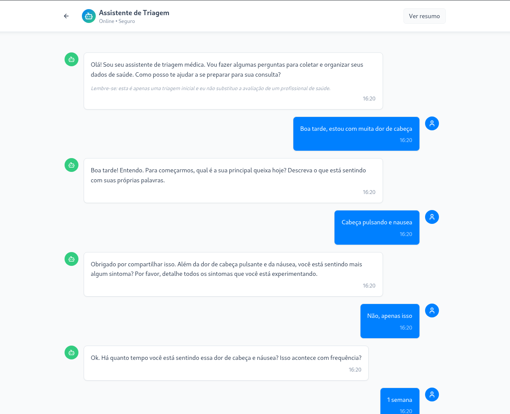
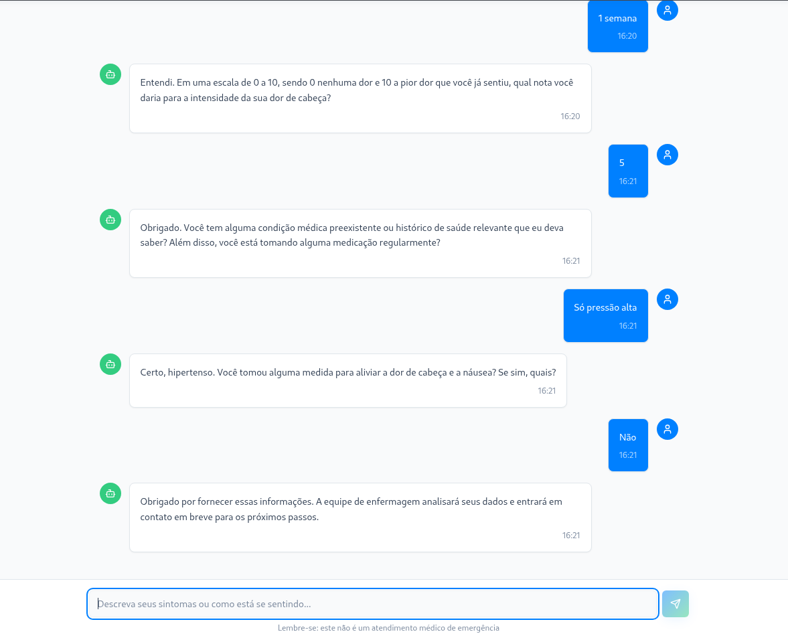
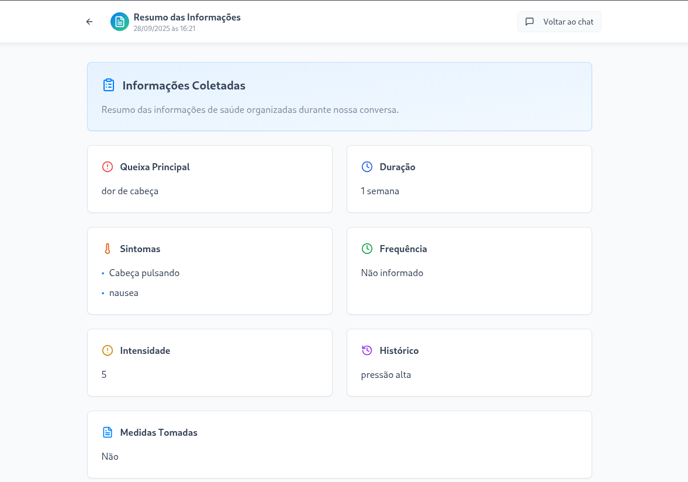

# 🤖 ClinicAI - Chatbot de Triagem Médica

Projeto desenvolvido como desafio técnico para estágio Backend.  
Consiste em um **chatbot de triagem médica** com persona acolhedora, que recebe mensagens de usuários, responde usando a API Gemini e armazena interações no **MongoDB**.  
O frontend foi criado com **Lovable (React + Tailwind via Vite)** e o backend com **FastAPI**.

---

## 📂 Estrutura do Projeto

```

agente-clinicAi-main/
├── back/                # Backend (FastAPI + PyMongo + Gemini API)
│   ├── main.py
│   ├── requirements.txt
│   └── src/
│       ├── config/      # Conexão Mongo e Gemini
│       ├── controllers/ # Lógica dos endpoints
│       ├── models/      # Pydantic models (conversa, prompt)
│       ├── routes/      # Rotas da API
│       └── services/    # Banco de dados e LLM
└── front/               # Frontend (Lovable: React + Vite + Tailwind)
    ├── src/
    ├── public/
    └── package.json

````

---

## ⚙️ Pré-requisitos

- **Python 3.9+**
- **Node.js 18+** (para o frontend)
- **MongoDB Atlas** (ou local)
- Conta no **Google AI Studio** com chave da API Gemini

---

## 🚀 Como rodar o Backend (FastAPI)

1. Crie e ative um ambiente virtual:
   ```bash
   cd back
   python3 -m venv venv
   source venv/bin/activate
    ````

2. Instale as dependências:

   ```bash
   pip install -r requirements.txt
   ```

3. Configure variáveis de ambiente (`.env`):

   ```
   IA_API_KEY=sua_chave_api
   MONGODB_URL=sua_url_mongo
   ```

4. Rode o servidor:

   ```bash
   uvicorn main:app --reload
   ```

O backend rodará em: [http://localhost:8000](http://localhost:8000)
Documentação Swagger: [http://localhost:8000/docs](http://localhost:8000/docs)

---

## 💻 Como rodar o Frontend (Lovable)

1. Instale as dependências:

   ```bash
   cd front
   npm install
   ```

2. Rode o servidor de desenvolvimento:

   ```bash
   npm run dev
   ```

O frontend rodará em: [http://localhost:5173](http://localhost:5173)

---

## 🔑 Endpoints principais

### `POST /chat/message`

Envia mensagem do usuário e recebe resposta do agente.

```json
{
  "session_id": "uuid-gerado",
  "message": "Estou com dor de cabeça há dois dias"
}
```

Resposta:

```json
{
  "session_id": "uuid-gerado",
  "reply": "Entendi. Pode me contar se a dor é constante ou vem em crises?"
}
```

### `GET /chat/summary/{session_id}`

Retorna o resumo da triagem em formato JSON estruturado:

```json
{
  "main_complaint": "Dor de cabeça",
  "symptoms": "Latejante, náusea",
  "duration": "2 dias",
  "intensity": 7,
  "history": "Episódios anteriores de enxaqueca",
  "measures_taken": "Dipirona sem melhora"
}
```

---

## 🖼️ Demonstração

### Fluxo de conversa no frontend:





### Resumo final da triagem:



*(adicione prints reais em `docs/images/` quando testar)*

---

## 📌 Observações

* O agente **não fornece diagnóstico** nem prescreve tratamento.
* Se detectar termos de **emergência**, interrompe a triagem e orienta buscar atendimento imediato.
* Uso da API Gemini está limitado ao plano gratuito (testar com cautela).

---

## 📈 Próximos passos

* Utilizar bibliotecas para gerenciamento de estados do agente.
* Melhorar persistência do histórico no Mongo.
* Adicionar autenticação simples (usuários).
* Testes automatizados de API.
* Deploy (Railway/Render para backend, Vercel/Netlify para frontend).

---

## 📜 Licença

MIT License.

```

---

👉 Quer que eu já monte esse README diretamente dentro do seu projeto (na pasta raiz do zip extraído) para você baixar pronto?
```
